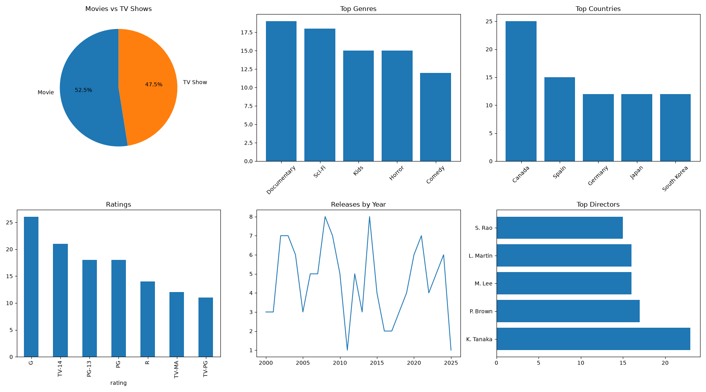

# Netflix Analytics Project

## Project Overview

This project analyzes the Netflix Titles dataset using Python. It includes data cleaning, exploratory data analysis (EDA), data visualization, dashboard creation, and business insights to understand Netflix content trends.

---

## Technologies Used

- Python
- Pandas
- NumPy
- Matplotlib
- Seaborn

---

## Dataset

- Dataset Name: `netflix_titles.csv`
- File Format: CSV

---

## Project Features

- Data Cleaning
- Missing Value Handling
- Duplicate Removal
- Date Conversion
- Feature Extraction
- Exploratory Data Analysis (EDA)
- Statistical Analysis
- Data Visualization
- Dashboard Creation
- Business Insights
- Export Cleaned Dataset
- Export Analysis Results

---

## Charts Generated

- Movies vs TV Shows
- Top Genres
- Top Countries
- Top Directors
- Ratings Count
- Release Year Distribution
- Releases by Year
- Movie Duration Boxplot
- Correlation Heatmap
- Dashboard

---

## Project Structure

```text
Netflix_Analytics_Project/
│
├── charts/
│   ├── dashboard.png
│   ├── correlation_heatmap.png
│   ├── movie_duration_boxplot.png
│   ├── movie_vs_tvshow.png
│   ├── ratings_count.png
│   ├── release_year_histogram.png
│   ├── releases_by_year.png
│   ├── top_countries.png
│   ├── top_directors.png
│   └── top_genres.png
│
├── output/
│   ├── analysis_results.csv
│   ├── business_insights.txt
│   └── cleaned_netflix_data.csv
│
├── netflix_analysis.py
├── netflix_titles.csv
├── requirements.txt
└── README.md
```

---

## How to Run

### Install Dependencies

```bash
pip install -r requirements.txt
```

### Run the Project

```bash
python netflix_analysis.py
```

---

## Output

- Cleaned Dataset (`cleaned_netflix_data.csv`)
- Analysis Results (`analysis_results.csv`)
- Business Insights (`business_insights.txt`)
- Dashboard (`dashboard.png`)
- Charts (`.png`)

---

## Dashboard


---

## Skills Demonstrated

- Python Programming
- Pandas
- NumPy
- Data Cleaning
- Exploratory Data Analysis (EDA)
- Data Visualization
- Statistical Analysis
- Dashboard Creation
- Business Insights
- Matplotlib
- Seaborn

---

## Conclusion

This project demonstrates an end-to-end data analysis workflow using Python. It covers data cleaning, exploratory data analysis (EDA), visualization, dashboard creation, and business insight generation using the Netflix Titles dataset.